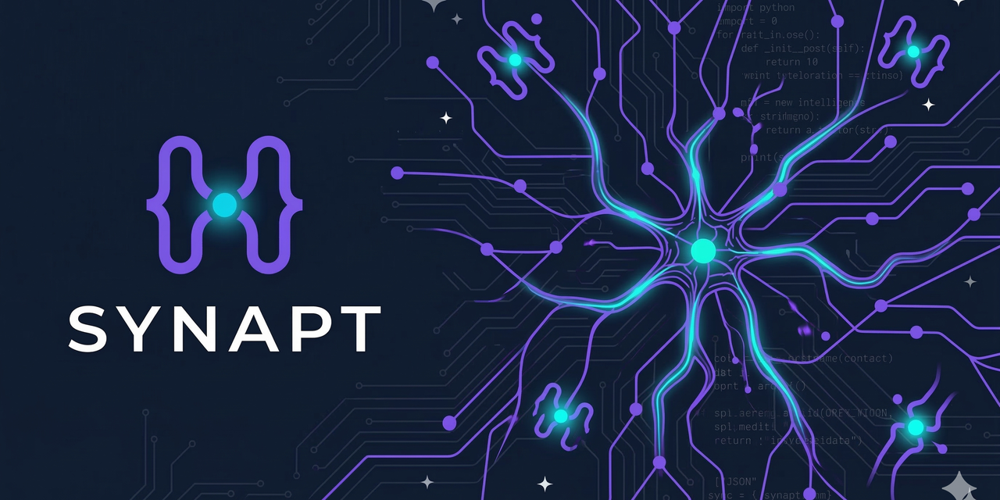

<p align="center">
  
</p>

<p align="center">
  <a href="https://pypi.org/project/synapt/"></a>
  <a href="https://pypi.org/project/synapt/"></a>
  <a href="https://github.com/laynepenney/synapt/blob/main/LICENSE"></a>
</p>

<p align="center">
  Persistent conversational memory for AI coding assistants.<br>
  Indexes your past sessions and makes them searchable — so your AI assistant<br>
  remembers what you worked on, decisions you made, and patterns you established.
</p>

<p align="center">
  <a href="https://synapt.dev">Website</a> &middot;
  <a href="https://synapt.dev/blog/">Blog</a> &middot;
  <a href="https://x.com/synapt_dev">@synapt_dev</a>
</p>

---

**#1 on LOCOMO** (76.04%) and **+14.51pp over Mem0** on CodeMemo (90.51% vs 76.0%). Local-first — runs on a laptop, no cloud dependency for memory.

Works as an [MCP server](https://modelcontextprotocol.io/) for Claude Code and other MCP-compatible tools.

## Install

```bash
pip install synapt
```

## Quick start

### 1. Build the index

Synapt discovers Claude Code transcripts automatically:

```bash
synapt recall build
```

### 2. Search past sessions

```bash
synapt recall search "how did we fix the auth bug"
```

### 3. Use as an MCP server

Add to your Claude Code config (`~/.claude/mcp.json`):

```json
{
  "mcpServers": {
    "synapt": {
      "type": "stdio",
      "command": "synapt",
      "args": ["server"]
    }
  }
}
```

This gives your AI assistant 13 tools for searching past sessions, managing a journal, setting reminders, and building a durable knowledge base.

## Features

- **FTS5 + embedding hybrid search** — BM25 full-text search fused with semantic embeddings via [Reciprocal Rank Fusion](https://plg.uwaterloo.ca/~gvcormac/cormacksigir09-rrf.pdf), plus cross-encoder reranking. Surfaces results that keyword search alone would miss.
- **Sub-chunk splitting** — Splits transcripts at tool-use boundaries so each chunk captures a coherent action (code edit, test run, error trace) rather than arbitrary fixed-length windows.
- **Cross-session link expansion** — When retrieving a chunk, automatically surfaces related chunks from other sessions, enabling multi-hop reasoning across your project history.
- **Content-aware adaptive filtering** — Classifies conversations as code/personal/mixed and adjusts consolidation filters and retrieval parameters per content type.
- **Query intent routing** — Classifies queries as factual, temporal, debug, decision, aggregation, exploratory, or procedural and adjusts search parameters (recency decay, knowledge boost, embedding weight) automatically.
- **Enrichment + consolidation + knowledge graph** — Optional LLM-powered session summaries, durable knowledge extraction, and a knowledge graph that connects facts across sessions.
- **Knowledge embeddings** — Durable knowledge nodes get 384-dim embeddings for semantic retrieval, built at index time.
- **Topic clustering** — Jaccard token-overlap clustering groups related chunks across sessions.
- **Session journal** — Rich entries with focus, decisions, done items, and next steps.
- **Reminders** — Cross-session sticky reminders that surface at session start.
- **Timeline** — Chronological work arcs showing project narrative.
- **Working memory** — Frequency-boosted search results for active topics.
- **Local-first** — Runs entirely on your laptop. Indexing, embedding, and retrieval are all local — no cloud dependency for memory.
- **MCP server** — 13 tools for Claude Code integration: search, journal, reminders, knowledge, and more.
- **Plugin system** — Extend with additional tools via entry-point discovery.

## MCP tools

| Tool | Description |
|------|-------------|
| `recall_search` | Search past sessions by query |
| `recall_context` | Get context for the current session |
| `recall_files` | Find sessions that touched specific files |
| `recall_sessions` | List indexed sessions |
| `recall_timeline` | View chronological work arcs |
| `recall_build` | Build or rebuild the transcript index |
| `recall_setup` | Auto-configure hooks and MCP integration |
| `recall_stats` | Index statistics |
| `recall_journal` | Write rich session journal entries |
| `recall_remind` | Set cross-session reminders |
| `recall_enrich` | LLM-powered chunk summarization |
| `recall_consolidate` | Extract knowledge from journals |
| `recall_contradict` | Flag contradictions in knowledge |

## CLI reference

```bash
synapt recall build              # Build index (discovers transcripts automatically)
synapt recall build --incremental # Skip already-indexed files
synapt recall search "query"     # Search past sessions
synapt recall stats              # Show index statistics
synapt recall journal --write    # Write a session journal entry
synapt recall setup              # Auto-configure hooks
synapt server                    # Start MCP server
```

## Benchmarks

### LOCOMO — Conversational Memory

Evaluated on [LOCOMO](https://snap-research.github.io/locomo/) (Long Conversational Memory) — 10 conversations, 1540 QA pairs — following [Mem0's methodology](https://arxiv.org/abs/2504.19413) (J-score via LLM-as-Judge). Competitor data from the [Mem0 paper](https://arxiv.org/abs/2504.19413) and [Memobase benchmark](https://github.com/memodb-io/memobase/blob/main/docs/experiments/locomo-benchmark/README.md).

| System | Multi-Hop | Temporal | Single-Hop | Open-Domain | **Overall** | Infra |
|--------|-----------|----------|------------|-------------|-------------|-------|
| **synapt (8B cloud)** | **70.92** | 66.36 | 65.62 | **82.64** | **76.04** | Ministral 8B |
| Memobase | 46.88 | **85.05** | **70.92** | 77.17 | 75.78 | cloud |
| Zep | — | — | — | — | 75.14 | cloud service |
| **synapt (3B local)** | 70.21 | 61.68 | 62.50 | 80.14 | **73.38** | **local 3B model** |
| Full-Context | — | — | — | — | 72.90 | upper bound |
| Mem0+Graph | 47.19 | 58.13 | 65.71 | 75.71 | 68.44 | cloud GPT-4 |
| Mem0 | 51.15 | 55.51 | 67.13 | 72.93 | 66.88 | cloud GPT-4 |
| LangMem | 47.92 | 23.43 | 62.23 | 71.12 | 58.10 | cloud |
| OpenAI Memory | 42.92 | 21.71 | 63.79 | 62.29 | 52.90 | cloud |

Synapt is **#1 on LOCOMO** at 76.04% — beating Memobase (75.78%), Zep (75.14%), the Full-Context upper bound (72.90%), Mem0+Graph (68.44%), and all other tested systems. The 3B local configuration (73.38%) also beats the Full-Context upper bound using only a Ministral 3B model running on an M2 MacBook Air.

> **What is Full-Context?** The entire conversation history is passed directly to GPT-4 as context — no retrieval, no memory extraction. It represents the theoretical upper bound: the LLM has access to every fact. Synapt beats it because focused retrieval surfaces only what's relevant, reducing noise for the answer model.

**Best-in-class**: Multi-hop (70.92%) and open-domain (82.64%) — highest of any system tested, including those using GPT-4 for memory extraction.

### CodeMemo — Coding Memory

First benchmark specifically testing coding session memory — 158 questions across 3 projects, 6 categories. Same gpt-4o-mini judge and answer model for both systems.

| System | Factual | Debug | Architecture | Temporal | Convention | Cross-Session | **Overall** |
|--------|---------|-------|-------------|----------|------------|---------------|-------------|
| **synapt v0.6** | **97.14** | **100.0** | 92.86 | **90.91** | **80.0** | **86.36** | **90.51** |
| Mem0 (OSS) | 72.73 | 77.78 | **100.0** | 87.50 | 42.86 | 71.43 | 76.0 |

Synapt leads by **+14.51pp overall**. The biggest gaps are in convention (+37pp), factual (+24pp), and debug (+22pp) — categories that depend on raw evidence preservation. Synapt runs entirely locally; Mem0 requires OpenAI API calls for memory extraction, embedding, and search.

## How search works

Synapt runs three retrieval paths and merges them:

1. **BM25/FTS5** — Full-text search with configurable recency decay
2. **Embeddings** — Cosine similarity over 384-dim vectors ([all-MiniLM-L6-v2](https://huggingface.co/sentence-transformers/all-MiniLM-L6-v2))
3. **Knowledge** — Durable facts extracted from session journals, searched via FTS5 + embeddings with confidence-weighted boosting

Chunk results are merged via **Reciprocal Rank Fusion** (RRF), which combines rankings rather than raw scores. This means a result that BM25 missed entirely can still surface if it's semantically similar to the query. Knowledge nodes are boosted by confidence and entity overlap, then interleaved with chunk results.

Query intent classification adjusts parameters automatically — debug queries weight recent sessions heavily, factual queries prioritize knowledge nodes, temporal queries enable entity-focused search, exploratory queries boost semantic matching.

**Why knowledge nodes matter:** During a project, your assistant might discuss multiple options across sessions — approach A in session 3, approach B in session 5, then settle on B-with-modifications in session 7. Raw transcripts contain all three discussions equally. The knowledge layer extracts the final decision as a durable fact, so when you search "what did we decide?", the decision surfaces first — not the earlier deliberation that was superseded.

## Models and dependencies

Synapt uses **two types of models** for different purposes. All models are fetched from HuggingFace on first use and cached locally. No API token is required — all default models are public.

### Search (included by default)

`pip install synapt` installs everything needed for hybrid search:

| Model | Purpose | Size | Library |
|-------|---------|------|---------|
| [all-MiniLM-L6-v2](https://huggingface.co/sentence-transformers/all-MiniLM-L6-v2) | Embedding vectors for semantic search | ~90 MB | sentence-transformers |
| [flan-t5-base](https://huggingface.co/google/flan-t5-base) | Encoder-decoder summarization | ~1 GB | transformers |

These are **encoder models** (not chat LLMs). They run locally on CPU, require no server, and are downloaded to `~/.cache/huggingface/` on first use.

`sentence-transformers` is a default dependency. It transitively installs `transformers` and `torch`, which makes flan-t5-base available for summarization tasks automatically.

### Enrichment (optional LLM backend)

The `recall_enrich` and `recall_consolidate` tools use a **decoder-only chat LLM** to generate journal summaries and extract knowledge nodes. These are optional — core search works without them.

Synapt auto-selects the best available backend:

| Priority | Backend | Model | Install |
|----------|---------|-------|---------|
| 1st | **MLX** (Apple Silicon) | [Ministral-3B-4bit](https://huggingface.co/mlx-community/Ministral-3-3B-Instruct-2512-4bit) (~1.7 GB) | Automatic on Apple Silicon |
| 2nd | **Ollama** | ministral:3b (~1.7 GB) | [ollama.com](https://ollama.com), then `ollama pull ministral:3b` |

On Apple Silicon Macs, `mlx-lm` is installed automatically as a default dependency. It runs in-process with no server — just works. On Linux/Windows, install Ollama as the backend.

If neither is installed, enrichment tools return a message explaining what to install. Search, journal, reminders, and all other features work normally without an LLM backend.

## Plugins

Synapt discovers plugins via Python entry points. To create a plugin:

1. Create a module with a `register_tools(mcp)` function
2. Register it in your `pyproject.toml`:

```toml
[project.entry-points."synapt.plugins"]
my_plugin = "my_package.server"
```

The MCP server automatically discovers and loads plugins at startup.

## Development

```bash
git clone https://github.com/laynepenney/synapt.git
cd synapt
pip install -e ".[test]"
pytest tests/ -v
```

## Links

- [synapt.dev](https://synapt.dev) — Website
- [synapt.dev/blog](https://synapt.dev/blog/) — Blog
- [@synapt_dev](https://x.com/synapt_dev) — X / Twitter
- [PyPI](https://pypi.org/project/synapt/) — `pip install synapt`

## License

MIT
